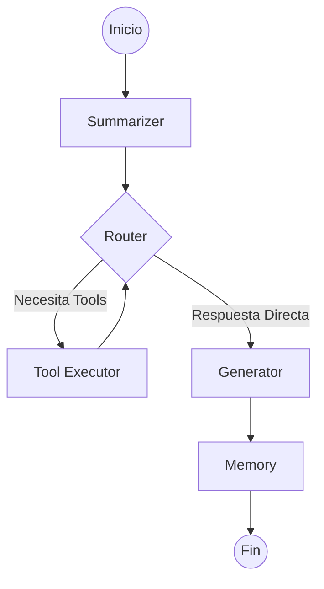

# Orquestación con LangGraph

El flujo de trabajo del agente está gestionado por un grafo de estados dinámico, permitiendo una lógica de "razonamiento" compleja y aprendizaje continuo.

## El Grafo de Estados

El grafo está definido en `src/graph.ts` y utiliza cinco nodos principales:

### 1. Summarizer Node
Es el punto de entrada. Analiza el historial de mensajes y, si excede cierto límite, genera un resumen para mantener el contexto ligero y ahorrar tokens.

### 2. Router Node
Es el "cerebro" de decisión. Recibe el estado y decide el camino:
- **Tools**: Si detecta que necesita información externa.
- **Direct**: Si puede responder con su conocimiento o ya tiene la información necesaria.

### 3. Tool Executor Node
Maneja la ejecución técnica de las herramientas. Soporta **paralelización real**. Una vez ejecutadas, devuelve el control al Router para que este decida si necesita más herramientas o si ya puede responder.

### 4. Generator Node
Cuando el Router decide que tiene suficiente información, este nodo sintetiza la respuesta final al usuario.

### 5. Memory Node
Después de generar la respuesta, este nodo analiza la interacción en segundo plano para extraer y guardar información relevante sobre el usuario (preferencias, nombre, etc.).

---

## Definición del Estado (`AgentState`)

El estado es el objeto que viaja a través del grafo. Contiene:
- `messages`: El historial completo de la charla.
- `selectedTools`: La lista de herramientas que el Router decidió usar.
- `toolResults`: Un mapa con los resultados crudos de cada ejecución.
- `response`: El string de respuesta final.

---

## Diagrama de Flujo

## Beneficios del Enfoque con Grafo
- **Recuperación de Errores**: El ciclo entre Router y Executor permite al agente re-intentar o corregir su búsqueda si los primeros resultados no son satisfactorios.
- **Escalabilidad**: Es fácil añadir nuevos nodos (ej. un nodo de validación de hechos) sin romper la lógica existente.
- **Eficiencia**: El Summarizer asegura que el contexto no crezca indefinidamente.
