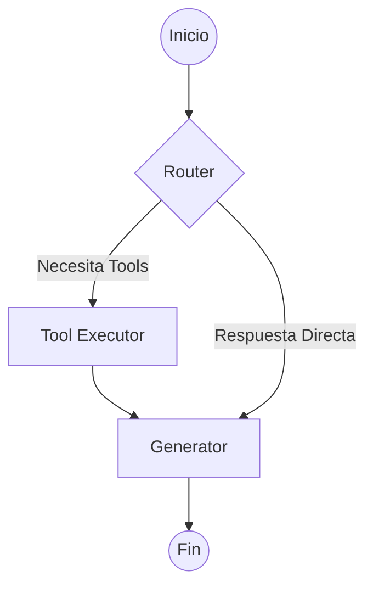

# Orquestación con LangGraph

El flujo de trabajo del agente está gestionado por un grafo de estados dinámico, permitiendo una lógica de "razonamiento" más compleja que un simple chatbot lineal.

## El Grafo de Estados

El grafo está definido en `src/graph.ts` y utiliza tres nodos principales:

### 1. Router Node
Es el "cerebro" inicial. Recibe el mensaje y decide el camino:
- **Cerrar**: Si el usuario se despide.
- **Tools**: Si detecta que necesita información externa.
- **Direct**: Si puede responder con su conocimiento interno.

### 2. Tool Executor Node
Maneja la ejecución técnica de las herramientas. Soporta **paralelización real**, ejecutando múltiples herramientas al mismo tiempo si el Router así lo decide.

### 3. Generator Node
Toma el historial de la conversación y los resultados de las herramientas para redactar la respuesta final al usuario.

---

## Definición del Estado (`AgentState`)

El estado es el objeto que viaja a través del grafo. Contiene:
- `messages`: El historial completo de la charla.
- `selectedTools`: La lista de herramientas que el Router decidió usar.
- `toolResults`: Un mapa con los resultados crudos de cada ejecución.
- `response`: El string de respuesta final.

---

## Diagrama de Flujo

## Beneficios del Enfoque con Grafo
- **Recuperación de Errores**: Podríamos añadir ciclos para que el agente re-intente una búsqueda si el primer resultado no fue satisfactorio.
- **Escalabilidad**: Es fácil añadir nuevos nodos (ej. un nodo de validación de hechos) sin romper la lógica existente.
